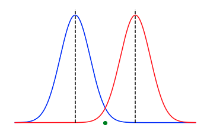

# Common variance

In the next couple of tasks, we will come back to the topic of hypothesis tests for the comparison of means.  Before we get on to that, however, we need to consider the subject of common variance.  Recall that the sample variance is computed as:

^2\right])

Now suppose that we are doing a comparison of means.  One of our sets of data points is a series of samples from the distribution that is shown in the red in the figure below.  The other set of data points, meanwhile, is a series of samples from the distribution that is shown in blue in the figure below. 

If we have only a small number of samples from these two distributions then we need to use the student t-distribution rather than the normal distribution when we test if these two distributions share a common mean.  As you will see in the next task, however, we need to provide a single value for the variance when we perform a hypothesis test to compare means test using the t-distribution.  In other words, we cannot insert the estimates of the sample variances that we got for the first and second sets of data points into the expression for the test statistic as we did when we assumed the statistic was normally distribution under the assumption of the null hypothesis.     

We thus have to find a way to calculate the common variance that will be used in the hypothesis test.  The most obvious way to do this is to sum over the data points from the two groups when calculating the first and second sums in the formulas above.  This is not a particularly sensible option, however.  Consider the figure above.  The green dot shows the common mean for the two distributions, which sits at the midpoints between the two distributions.  If you recall that the variance is the average of the square of the distance from the mean you would thus get a very large value for the variance if you calculated the variance in this way as all the points in the two distributions are quite far from the green dot.  In summary, the problem in calculating the total variance using all the data points in the distribution is that the "total" variance that emerges depends on the difference in the means for the two distributions.  We thus calculate the common variance using:

s_1^{2}%2B(n_2-1)s_2^2}{n_1%2Bn_2-2})

where  and  are the estimates of the standard deviations for the first and second sets of points that are calculated using the formula at the top of this page respectively.

I have written some code in `main.py` to show you why this formula provides a better estimate to use for the sample variance than the variance that is calculated by simply concatenating the data from the first and second samples.  __To get this code to run you need to complete the two functions:__

1. `sample_variance` - takes a NumPy array in input called `data`.  Within this function, you should calculate the sample variance using the formula at the top of this set of instructions.  This quantity should then be returned.
2. `common_variance` - takes two NumPy arrays in input called `data1` and `data2`.   You should use the second equation on this page to calculate and return the common variance for these two data sets.  In order to do this, you will need to include two calls to `sample_variance`.  The first of these calls will estimate the variance for the NumPy array called `data1`.  The second will estimate the variance for the Numpy array called `data2`.

Once you have completed these two functions you can run the program.  __A graph will be generated, which you should look at__.  To generate this graph I wrote a loop.  On each passage through the for loop 100 data points from a standard normal distribution and 100 data points are generated from a normal distribution with variance one that moves progressively further and further from zero.  How the total variance calculated by concatenating these two data sets and using the equation at the top of the page depends on the distance between the two distributions is shown with the red points.   The dependence of the estimate of the total variance computed using the second formula above on the distance between the two distributions, meanwhile, is shown with blue points.  As you can see, if the total variance is calculated by concatenating the two sets of samples there is a strong dependence on the difference between the means of the two distributions.  If, by contrast, I calculate the total variance using the second formula on this page the variance does not depend on the distance between the two distributions.  You should thus calculate the variance in this second way when you perform the hypothesis tests that will be discussed in the next few tasks. 
